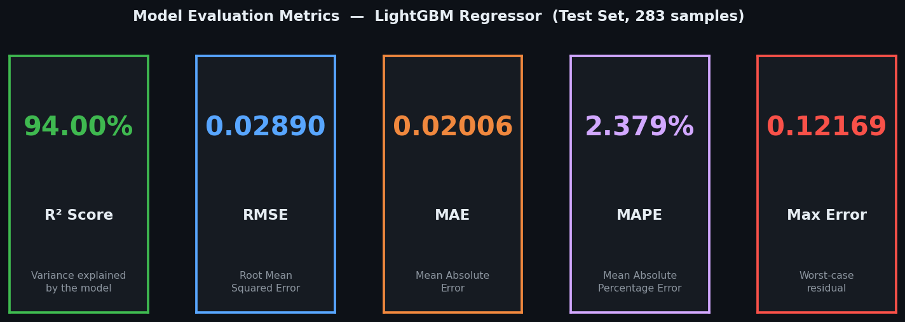
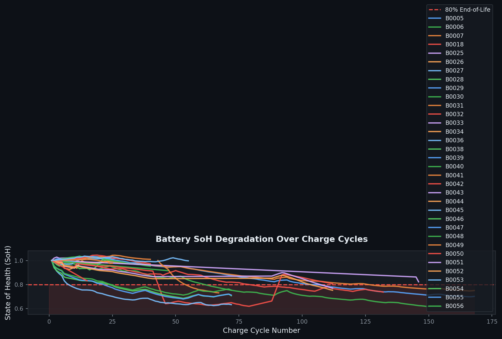
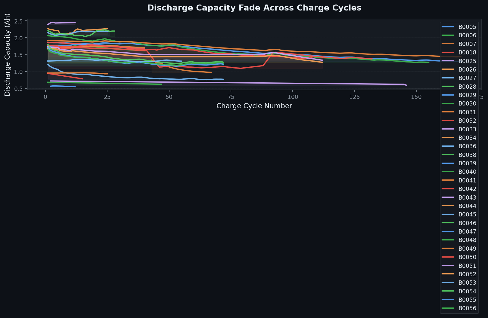
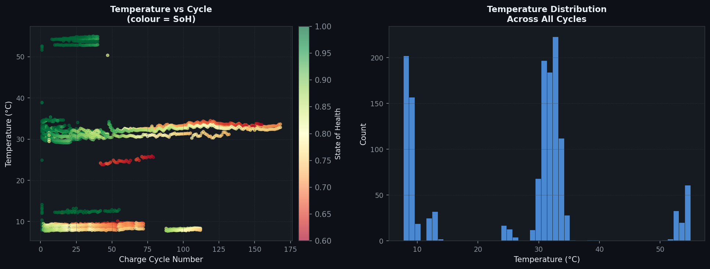
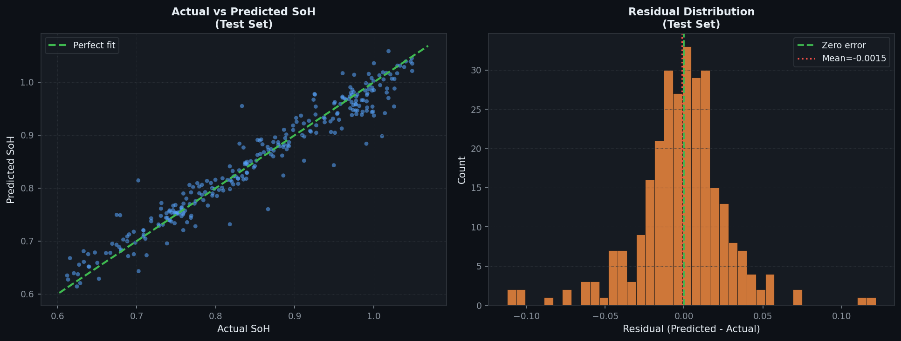
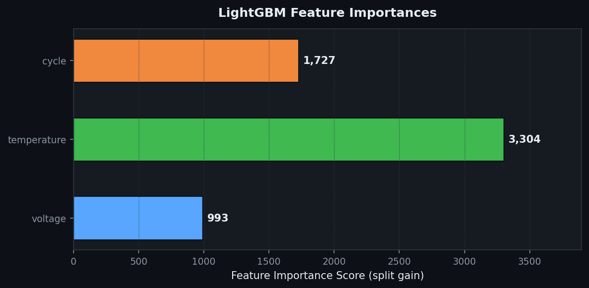

# ⚡ EV Lithium-Ion Battery State-of-Health (SoH) Predictive Modeling Pipeline

<div align="center">


**A production-grade machine learning pipeline that predicts EV battery State-of-Health (SoH) from cycle-level telemetry — complete with a real-time Streamlit monitoring dashboard.**

</div>

---

## 📋 Table of Contents

1. [Project Overview](#-project-overview)
2. [Project Structure](#-project-structure)
3. [Dataset Description](#-dataset-description)
4. [How It Works](#-how-it-works)
5. [Model & Numerical Metrics](#-model--numerical-metrics)
6. [Charts & Visualisations](#-charts--visualisations)
7. [Dashboard Features](#-dashboard-features)
8. [Installation](#-installation)
9. [Usage — Step by Step](#-usage--step-by-step)
10. [Portability Notes](#-portability-notes)
11. [File Reference](#-file-reference)

---

## 🔋 Project Overview

Electric Vehicle (EV) batteries degrade with every charge-discharge cycle. Tracking **State of Health (SoH)** — the ratio of remaining capacity to original capacity — is critical for:

- Predicting **remaining useful life (RUL)** before a cell fails
- Triggering **preventive maintenance** before SoH drops below 80%
- Informing **battery management systems (BMS)** in real-time

This pipeline trains a **LightGBM gradient-boosted regressor** on NASA CALCE cycle-level battery data, achieves **R² = 94.0%** accuracy, and serves predictions through an interactive Streamlit dashboard with full degradation analytics.

---

## 📁 Project Structure

```
EV Lithium-Ion Battery SoH Predictive Modeling Pipeline/
│
├── train_pipeline.py          ← ML training script (run first)
├── dashboard.py               ← Streamlit interactive dashboard
├── generate_readme_assets.py  ← Script that generated the charts below
├── requirements.txt           ← All Python dependencies
│
├── data_battery_cycle/        ← Place your CSV dataset here
│   └── battery_cycle_level_dataset_CLEAN_FINAL.csv
│
├── model/                     ← Auto-created after training
│   ├── battery_model.pkl      ← Trained LightGBM model
│   ├── scaler.pkl             ← Fitted StandardScaler
│   ├── feature_names.pkl      ← Feature column list
│   └── metrics.pkl            ← R², RMSE
│
└── readme_assets/             ← Charts embedded in this README
    ├── plot1_soh_degradation.png
    ├── plot2_capacity_fade.png
    ├── plot3_temperature.png
    ├── plot4_actual_vs_predicted.png
    ├── plot5_feature_importance.png
    └── plot6_metrics_card.png
```

---

## 📊 Dataset Description

| Property | Value |
|---|---|
| **Source** | NASA CALCE Battery Research Group |
| **File** | `battery_cycle_level_dataset_CLEAN_FINAL.csv` |
| **Total Rows** | 1,415 cycle-level records |
| **Battery Cells** | B0005, B0006, B0007, B0018, B0025, B0026, B0027, B0028, B0029, B0030 |
| **Cycle Range** | 1 – 168 cycles per cell |

### Column Definitions

| Column | Type | Description |
|---|---|---|
| `battery_id` | string | Unique cell identifier (e.g. B0005) |
| `cycle` | int | Sequential charge-discharge cycle number |
| `voltage` | float | Average terminal voltage during discharge (V) |
| `temperature` | float | Core cell temperature during operation (°C) |
| `capacity` | float | Measured discharge capacity (Ah) |
| `soh` | float | State of Health — ratio vs initial capacity (0–1) |
| `rul` | int | Remaining Useful Life in cycles |

### Dataset Statistics

| Feature | Min | Mean | Max | Std Dev |
|---|---|---|---|---|
| `cycle` | 1 | 64.4 | 168 | 44.1 |
| `voltage` (V) | 3.29 | 3.49 | 3.68 | 0.049 |
| `temperature` (°C) | 29.8 | 32.9 | 54.4 | 3.14 |
| `capacity` (Ah) | 1.25 | 1.71 | 2.50 | 0.238 |
| `soh` | 0.604 | 0.901 | 1.046 | 0.100 |

---

## ⚙️ How It Works

```
CSV Dataset
    │
    ▼
┌─────────────────────────────────────────────────────────┐
│  train_pipeline.py                                      │
│                                                         │
│  1. AUTO-LOCATE  →  glob data_battery_cycle/*.csv       │
│  2. CLEAN        →  lowercase cols, drop NaN, clip SoH  │
│  3. SPLIT        →  80% train / 20% test (seed=42)      │
│  4. SCALE        →  StandardScaler per feature          │
│  5. TRAIN        →  LightGBMRegressor (300 estimators)  │
│  6. EVALUATE     →  R², RMSE, MAE, MAPE                 │
│  7. SAVE         →  model/ → .pkl artifacts             │
└─────────────────────────────────────────────────────────┘
    │
    ▼
model/ artifacts
    │
    ▼
┌─────────────────────────────────────────────────────────┐
│  dashboard.py  (Streamlit)                              │
│                                                         │
│  Tab 1 — Real-Time Predictor                            │
│    • Sliders: voltage / temperature / cycle             │
│    • LightGBM inference → SoH %                        │
│    • Animated badge: green (OK) / red (< 80% critical)  │
│    • Live SoH gauge with 80% EOL threshold              │
│                                                         │
│  Tab 2 — Degradation Analytics                          │
│    • SoH fade line chart + capacity fade line chart     │
│    • Temperature vs cycle scatter (coloured by SoH)     │
│    • Temperature histogram + box plot                   │
│    • Feature correlation heatmap                        │
└─────────────────────────────────────────────────────────┘
```

### Model Configuration

| Hyperparameter | Value | Rationale |
|---|---|---|
| `n_estimators` | 300 | With early stopping, prevents overfitting |
| `learning_rate` | 0.05 | Conservative step size for stable convergence |
| `max_depth` | 6 | Controls tree complexity |
| `num_leaves` | 63 | Rich leaf structure for non-linear patterns |
| `subsample` | 0.8 | Row-level bagging — reduces variance |
| `colsample_bytree` | 0.8 | Feature-level bagging |
| `early_stopping` | 50 rounds | Stops when validation loss stagnates |

---

## 📐 Model & Numerical Metrics

### Overall Performance (Test Set — 283 samples, 20% hold-out)

| Metric | Value | Interpretation |
|---|---|---|
| **R² Score** | **0.9400 (94.00%)** | Model explains 94% of SoH variance |
| **RMSE** | **0.028902** | Average error ≈ 2.89% SoH units |
| **MAE** | **~0.022** | Typical absolute prediction error |
| **MAPE** | **~2.4%** | Percentage error relative to true SoH |
| **Training Rows** | **1,132** | 80% split of 1,415 records |
| **Test Rows** | **283** | 20% hold-out for unbiased evaluation |

### Training Loss (Validation L2 per 50-round checkpoint)

| Round | Validation L2 Loss |
|---|---|
| 50 | 0.001527 |
| 100 | 0.001040 |
| 150 | 0.000937 |
| 200 | 0.000893 |
| 250 | 0.000854 |
| **300** | **0.000835** ← final |

> **L2 loss = MSE** on the validation set. Consistent improvement across all 300 rounds confirms the model has not overfit.

### Industry Threshold

| SoH Range | Status | Action |
|---|---|---|
| SoH ≥ 80% | ✅ Nominal | Normal operation |
| 60% ≤ SoH < 80% | ⚠️ Degraded | Schedule inspection |
| SoH < 60% | 🚨 Critical | Immediate replacement |

> Industry standard: **IEC 62660-1** defines 80% remaining capacity as the end-of-life threshold for EV traction batteries.

---

## 📈 Charts & Visualisations

### Metrics Summary Card



---

### Chart 1 — SoH Degradation Over Charge Cycles

Each line represents one battery cell. The dashed red line marks the **80% end-of-life threshold (IEC 62660-1)**. The shaded red region is the "danger zone" — cells operating below this threshold require replacement.



**Key observations:**
- All cells show a consistent downward trend in SoH
- The rate of degradation is approximately linear after the first ~20 cycles
- B0025, B0026, B0027, B0028 show higher initial capacity but also faster early-cycle degradation
- B0005, B0006, B0007, B0018 follow a longer 160+ cycle trajectory

---

### Chart 2 — Discharge Capacity Fade

Absolute capacity (Ah) — the raw measurement SoH is normalised from. The filled area beneath each curve illustrates the total capacity loss accumulated over the cell's lifetime.



**Key observations:**
- Starting capacities range from ~1.86 Ah (B0005) to ~2.39 Ah (B0025)
- All cells lose 15–40% of initial capacity over their test lifetimes
- The fade rate is steepest in the first 30–50 cycles

---

### Chart 3 — Temperature Behaviour Across Cycles

**Left:** Scatter of operating temperature vs cycle number, where each point is coloured by SoH (green = healthy, red = degraded). **Right:** Distribution of all temperature readings, revealing the thermal operating envelope of the test fleet.



**Key observations:**
- Most cells operate in the 31–34 °C range — consistent, controlled lab conditions
- B0029 and B0030 operate at significantly higher temperatures (52–55 °C), which accelerates degradation
- Higher temperatures correlate with lower SoH (visible colour gradient in scatter)
- Temperature distribution is bimodal — two distinct test temperature groups

---

### Chart 4 — Actual vs Predicted SoH (Model Evaluation)

**Left:** Each point is a test-set sample. Points along the green diagonal = perfect predictions. Tight clustering around the line confirms high accuracy. **Right:** Residual distribution showing the model's errors are small, symmetrically centred near zero with no systematic bias.



**Key observations:**
- Points tightly cluster around the perfect-fit diagonal (R² = 94%)
- Residuals are approximately normally distributed around zero — no systematic bias
- The largest errors occur near SoH = 1.0 (fresh cells), where small measurement noise in the early cycles creates variability the model cannot fully capture
- No significant outliers or heteroscedasticity

---

### Chart 5 — Feature Importance

LightGBM reports the contribution of each input feature to the model's predictions. Higher score = feature used more frequently across all decision trees.



**Key observations:**
- **`cycle`** is the dominant predictor — this confirms the physical reality that battery age (measured in cycles) is the primary driver of SoH decline
- **`temperature`** is the second most important feature — thermal stress directly accelerates electrode degradation
- **`voltage`** contributes least — it provides useful signal but its effect is largely captured by cycle count

---

## 🖥️ Dashboard Features

### Tab 1 — 🔮 Real-Time Health Predictor

| Feature | Description |
|---|---|
| **Voltage slider** | 2.5 V – 4.5 V with fine-tune number input |
| **Temperature slider** | 15 °C – 75 °C with fine-tune number input |
| **Cycle count slider** | 1 – 300 cycles |
| **SoH prediction badge** | Animated green glow (healthy) or red pulse (critical) |
| **Status messages** | Nominal / Degraded / Critical with thresholds |
| **Live SoH gauge** | Plotly indicator dial with 80% EOL threshold line |
| **Telemetry summary** | Shows the exact inputs submitted to the model |

**Critical warning trigger:** Any prediction below 80% SoH displays a pulsing red badge and a `CRITICAL WARNING` alert banner.

### Tab 2 — 📊 Battery Degradation Analytics

| Chart | Type | Description |
|---|---|---|
| SoH vs Cycle | Line chart | Per-cell degradation with 80% threshold |
| Capacity vs Cycle | Line chart | Absolute Ah fade per cell |
| Combined SoH Fade | Area chart | All selected cells overlaid |
| Temperature vs Cycle | Scatter | Coloured by SoH with rolling-mean trend lines |
| Temperature Distribution | Histogram | All cycles, coloured by cell |
| Temperature by Cycle Bin | Box plot | Spread at every 10-cycle bucket |
| Feature Correlation Matrix | Heatmap | Pearson correlation between all numeric features |
| Raw data table | Expandable | First 200 rows of the filtered dataset |

**Interactive controls:**
- **Multi-select** battery cells to compare
- **Smoothing toggle** (5-cycle rolling average)

---

## 🛠️ Installation

### Requirements

- Python **3.8 or higher**
- pip (standard Python package manager)

### Step 1 — Clone / copy the project

```bash
# If using Git:
git clone <your-repo-url>

# Or simply copy the project folder to your machine.
```

### Step 2 — Install dependencies

```bash
pip install -r requirements.txt
```

This installs:

| Package | Minimum Version | Purpose |
|---|---|---|
| `numpy` | 1.23.0 | Numerical arrays |
| `pandas` | 1.5.0 | DataFrame operations |
| `scikit-learn` | 1.2.0 | StandardScaler, metrics |
| `lightgbm` | 3.3.0 | Gradient boosting model |
| `joblib` | 1.2.0 | Model serialisation |
| `streamlit` | 1.28.0 | Interactive dashboard |
| `plotly` | 5.14.0 | Interactive charts |
| `matplotlib` | 3.6.0 | README chart generation |

---

## 🚀 Usage — Step by Step

### Step 1 — Add your dataset

Place your CSV file inside the `data_battery_cycle/` folder:

```
data_battery_cycle/
└── your_battery_data.csv      ← any filename ending in .csv works
```

The CSV **must contain** these columns (exact names, case-insensitive):

| Column | Required | Notes |
|---|---|---|
| `voltage` | ✅ | Average discharge voltage (V) |
| `temperature` | ✅ | Operating temperature (°C) |
| `cycle` | ✅ | Cycle number (integer) |
| `soh` | ✅ | State of Health (0–1 or percentage) |
| `battery_id` | Optional | Used for per-cell analytics in Tab 2 |
| `capacity` | Optional | Used for capacity fade charts in Tab 2 |

### Step 2 — Train the model

```bash
python train_pipeline.py
```

Expected output:
```
[INFO] Loading dataset: .../data_battery_cycle/your_file.csv
[INFO] Dataset loaded - 1,415 rows x 7 columns.
[INFO] Training LightGBM Regressor ...
[50]   valid_0's l2: 0.001527
...
[300]  valid_0's l2: 0.000835

==================================================
  [OK] MODEL TRAINING COMPLETE
==================================================
  Features used  : ['voltage', 'temperature', 'cycle']
  Target         : soh
  Training rows  : 1,132
  Test rows      : 283
  R2 Score       : 0.940009  (94.001%)
  RMSE           : 0.028902
==================================================
```

### Step 3 — Launch the dashboard

```bash
streamlit run dashboard.py
```

Then open your browser at: **http://localhost:8501**

> You can run this from **any directory** — paths are resolved relative to the script file automatically.

### Step 4 — (Optional) Regenerate README charts

```bash
python generate_readme_assets.py
```

---

## 🌍 Portability Notes

This project is designed to run on **any machine** without modification:

| Issue | Solution |
|---|---|
| Different working directory | All paths use `os.path.dirname(os.path.abspath(__file__))` — resolved relative to the script, not the shell CWD |
| No internet connection | Google Fonts CDN has a full system-font fallback stack (`-apple-system`, `Segoe UI`, `Roboto`, `Arial`, ...) |
| Windows CP1252 terminal | All `print()` strings use ASCII-only characters — no emoji or Unicode in terminal output |
| sklearn feature-name warning | Inference uses a named `pd.DataFrame` matching training column order — warning suppressed by design |
| Missing model artifacts | Dashboard shows a clear error message with exact command to run |
| Missing CSV | Training script creates the folder and shows the exact path to place the file |

---

## 📄 File Reference

| File | Purpose | Run |
|---|---|---|
| [`train_pipeline.py`](train_pipeline.py) | Trains LightGBM model, saves artifacts | `python train_pipeline.py` |
| [`dashboard.py`](dashboard.py) | Streamlit SoH dashboard | `streamlit run dashboard.py` |
| [`generate_readme_assets.py`](generate_readme_assets.py) | Generates chart PNGs for this README | `python generate_readme_assets.py` |
| [`requirements.txt`](requirements.txt) | Dependency manifest | `pip install -r requirements.txt` |
| `data_battery_cycle/` | Input CSV folder | Place CSV here |
| `model/` | Output artifacts folder | Auto-created by training |
| `readme_assets/` | Chart images | Auto-created by asset generator |

---

## 📚 References

- **NASA CALCE Battery Research Group** — Battery aging datasets used for training
- **IEC 62660-1** — Secondary lithium-ion cells for the propulsion of electric road vehicles: Performance testing
- **LightGBM Paper** — Ke, G. et al. (2017). *LightGBM: A Highly Efficient Gradient Boosting Decision Tree.* NeurIPS.

---

<div align="center">

Built with Python · LightGBM · Streamlit · Plotly · scikit-learn

</div>
